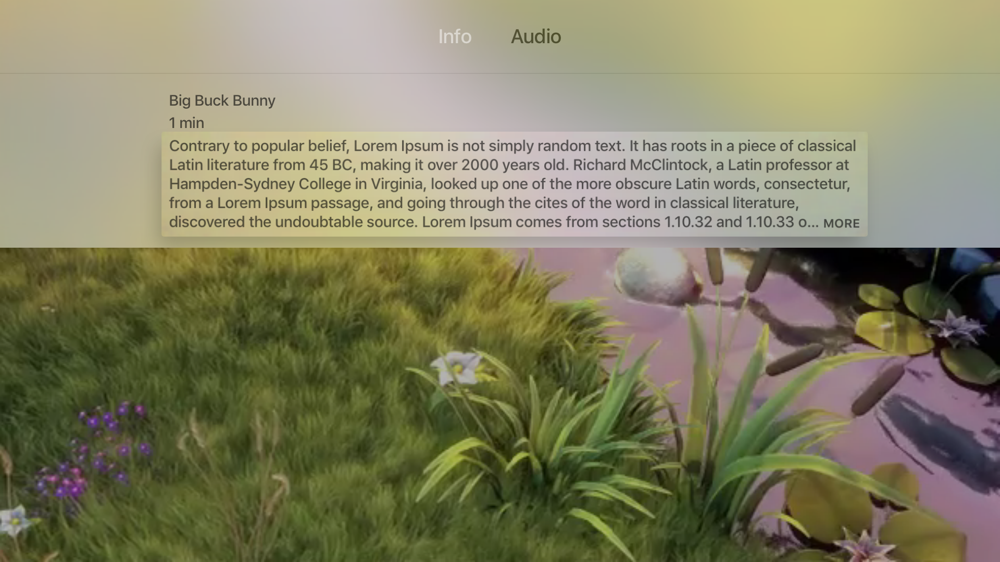
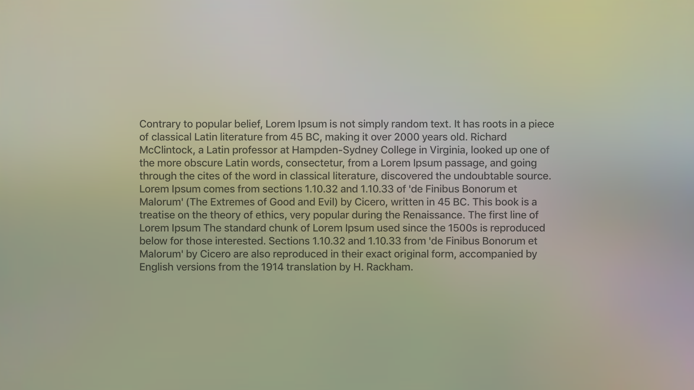

# tvOS-AVPlayerViewController-Bug
Project created to report bug on AVPlayerViewController

· Open radar: https://openradar.appspot.com/28733956

# Update

This issue was resolve in tvOS 11

# Description
When a very long description is provided on AVMetadataCommonIdentifierDescription, AVPlayerViewController allows expanding the description in a separated ViewController. 

This ViewController is presented modally and, when it is presented, the AVPlayer on the background is paused for no reason.

It happens not only for event streams but also for hls live streams, which might results in a problem when trying to resume the stream from a expired timeshift window.

# Expected 
AVPlayer continues playing on the background while the full description is presented modally.

# Steps

1.- Swipe down on Siri Remote to get the content information on the top navigation bar

2.- Focus and select the description

3.- 🔥 At this point the player was paused for no reason.
